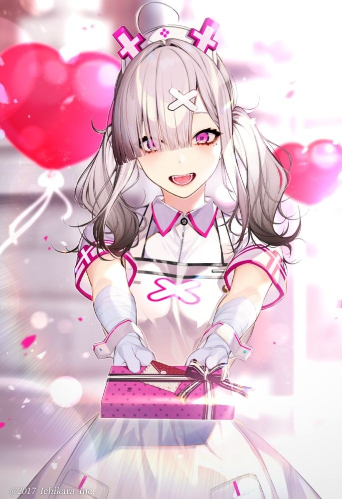

<div align="center">


# _**vTUBER-WIKI**_

> This is a small scraper i made for [https://virtualyoutuber.fandom.com](https://virtualyoutuber.fandom.com)  using their officail api and [hermitPurple](https://www.npmjs.com/package/hermitpurple)
</div>
<br>

# Install
```cmd
> npm i vTuber-wiki
```

# How-to

### Typescript/javascript
```TS 
import * as vTuber from 'vTuber-wiki'
// const vTuber = require("vTuber-wiki) ; for Js

vTuber.wiki(`Sukoya Kana`).then(async(output)=>{

    console.log(output)
})

```

## Example output
```TS 
 {
  title1: 'Sukoya Kana',
  image1: 'Sukoya Kana Portrait.png',
  caption1: '',
  original_name: '健屋花那',
  nick_name: '',
  debut_date: 'YouTube: 2019/09/21',
  character_designer: 'Illustration: https://twitter.com/kaya7hara Kayahara',
  affiliation: '[Nijisanji]',
  channel: 'https://www.youtube.com/channel/UC8C1LLhBhf_E2IBPLSDJXlQ YouTube<br> [https://twitcasting.tv/sukosuko_sukoya Twitcasting]<br>[https://space.bilibili.com/666726798 bilibili]',
  social_media: 'https://twitter.com/sukosuko_sukoya Twitter[https://www.reddit.com/user/Kana_Sukoya_2434/ Reddit]',
  official_website: 'https://nijisanji.ichikara.co.jp/member/kana-sukoya/ Nijisanji Member Profile[https://shop.nijisanji.jp/s/niji/group/list/080/item?ima',
  gender: 'Female',
  birthday: '14 May',
  height: '163 cm (167 cm including heels)',
  weight: '',
  blood_type: 'O',
  zodiac_sign: 'Taurus',
  class: '"article-table mw-collapsible mw-collapsed"!Title!Sale Period\n!Remarks',
  description: "*Sukoya Kana''' (健屋花那) is a female Japanese Virtual YouTuber and member of [Nijisanji].",
  image_url: 'https://static.wikia.nocookie.net/virtualyoutuber/images/4/42/Sukoya_Kana_Portrait.png/revision/latest/scale-to-width-down/350?cb',
  more: 'https://virtualyoutuber.fandom.com/wiki/Sukoya_Kana'
}

// will return null if no results

```
